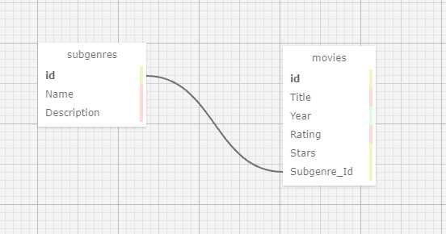

# Fear Generator

#### Create a watch list for the spooky season with all your horror movie favorites!

#### By Anna Clarke, Melissa Schatz-Miller, Diego Serafico

    

## Technologies Used

* _C#_
* _ASP.NET Core MVC_
* _.NET 5_
* _NuGet_
* _MSTest????_

## Description

This web application will allow users to create horror subgenres to organize their horror movie watch list. They can then add movies to each subgenre, giving each one a rating, number of stars, release year etc.

### Technology Requirements

* [.NET 5](https://dotnet.microsoft.com/download/dotnet/5.0)
* A text editor like [VS Code](https://code.visualstudio.com/)

## Setup/Installation Requirements

* _This is a great place_
* _to list setup instructions_
* _in a simple_
* _easy-to-understand_
* _format_

## Known Bugs

* _Any known issues_
* _should go here_

## License
_[GPL](https://opensource.org/licenses/gpl-license)_

## Contact Information
                       🍃
Anna Clarke: <anclarkie@gmail.com>
🍃 Melissa Schatz-Miller: <melissa.scmi@gmail.com>
Diego Serafico: <dseraficohernandez@gmail.com> 🍃
